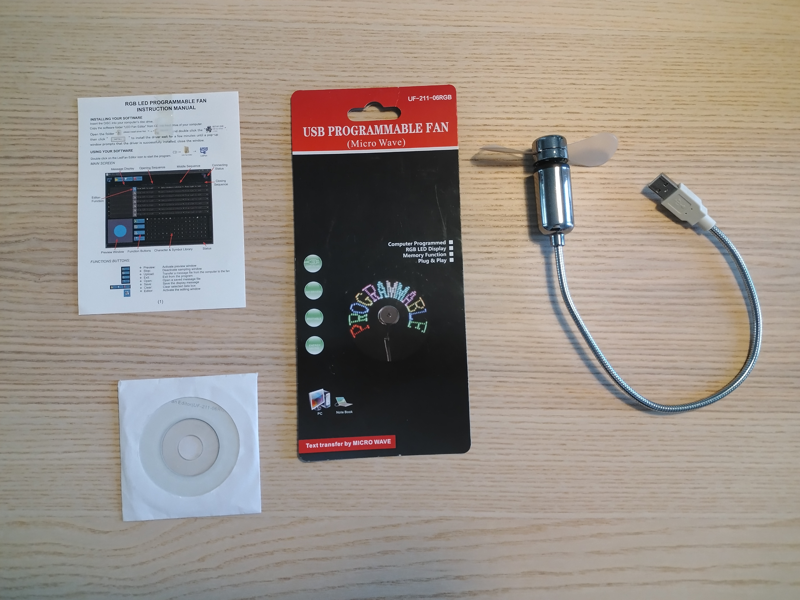

## USB programmable fan driver for UF-211-06RGB

It reports on USB with idVendor:idProduct of 1a86:5537, and the
device name "QinHeng Electronics WCH32 Virtual COM Port". But it
is not actually a COM port (at least I don't think it is).

This code can upload an arbitrary message to the device. The device
must be powered off (fan not spinning) for the upload to work.

### Original software
Original software is in `assets/`. There are two versions:
  - older, which based on my reverse engineering knows how
    to talk to idVendor:idProduct 0c45:7160; this is also
    uploaded to [archive.org](https://archive.org/details/USB-LED-Fan-Editor)
  - newer that knows how to handle 1a86:5537.

This repository handles only 1a86:5537, but it probably can be made to
work with 0c45:7160. I suspect the message format is identical.
